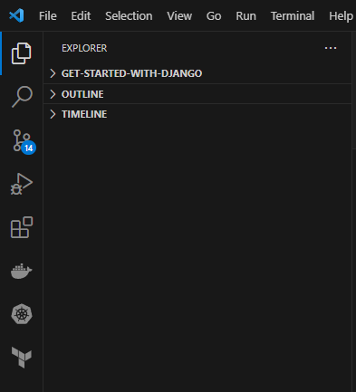
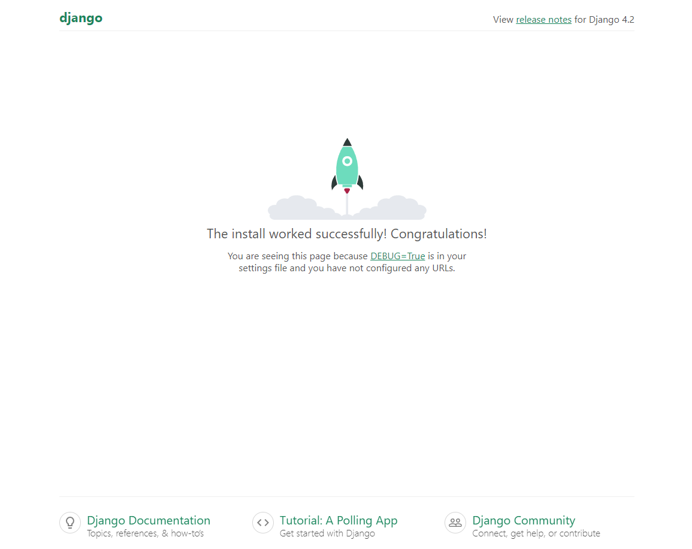

## **Get Started with Django 2023**
Django for Backend Development

---


You will need:
- Python Installed (e.g Anaconda)
- Visual Studio Code or other IDE

Finished Links:
- [Github](https://github.com/mo-justlearnai/Get-Started-with-Django)

## **[What is Django?](https://www.djangoproject.com/start/overview/)**  

## **[1. Download Anaconda](https://www.anaconda.com/)**

## **2. Create a Virtual Environment**

Before creating our Django app, we need to create a virtual environment to facilitate the runtime of our application.

If you're not familiar already with what a virtual environment is... it is an 'environment' that provides sectioning for projects to hold different packages / versions for its software.

Essentially, this creates an 'environment' virtually allowing specific libraries and versions for that venv (virtual environment) and you could create another venv with different libraries and versions. The venv are isolated and do not affect one another.

An example is you may want to run 2 Django applications... one with Django 4.0 and another with 4.1. You would therefore need 2 different virtual environments. One with Django v4.0 and the other with Django v4.1 to be able to run both versions of Django successfully. 

One final example. Imagine a car. A car needs fuel of course but it also needs brake fluid. These two solutions are kept in 2 separate places and serve 2 different purposes. You could say that the fuel needs an 'environment' to work and so does the brake fluid. You wouldn't mix you fuel with your brake fluid so you probably shouldn't do that for python projects. If you're starting a new project... start a new venv just in case the libraries and versions used in the new project need to be different. 

I am working in VSCode to develop this. 
[Download VS Code](https://code.visualstudio.com/)

Start a New Command Prompt Terminal in VS Code




First, let's check Anaconda is installed so we can run `conda` commands from the command prompt. 

**Run**

```shell
conda --version 
# conda 22.9.0
```

```shell
conda create --no-default-packages -n myvenv python=3.9.6
# Collecting package metadata (current_repodata.json): done
# Solving environment: failed with repodata from current_repodata.json, will retry with next repodata source.
#   ca-certificates    pkgs/main/win-64::ca-certificates-2023.05.30-haa95532_0 None
#   openssl            pkgs/main/win-64::openssl-1.1.1u-h2bbff1b_0 None
#   pip                pkgs/main/win-64::pip-23.1.2-py39haa95532_0 None
#   python             pkgs/main/win-64::python-3.9.6-h6244533_1 None
#   setuptools         pkgs/main/win-64::setuptools-67.8.0-py39haa95532_0 None
#   sqlite             pkgs/main/win-64::sqlite-3.41.2-h2bbff1b_0 None
#   tzdata             pkgs/main/noarch::tzdata-2023c-h04d1e81_0 None
#   vc                 pkgs/main/win-64::vc-14.2-h21ff451_1 None
#   vs2015_runtime     pkgs/main/win-64::vs2015_runtime-14.27.29016-h5e58377_2 None
#   wheel              pkgs/main/win-64::wheel-0.38.4-py39haa95532_0 None

# Proceed ([y]/n)? Y

# Downloading and Extracting Packages
# pip-23.1.2           | 2.8 MB    | ################################################################################################################################################################################# | 100% 
# openssl-1.1.1u       | 5.5 MB    | ################################################################################################################################################################################# | 100% 
# python-3.9.6         | 16.4 MB   | ################################################################################################################################################################################# | 100% 
# Preparing transaction: done
# Verifying transaction: done
# Executing transaction: done
# #
# # To activate this environment, use
# #
# #     $ conda activate myvenv
# #
# # To deactivate an active environment, use
# #
# #     $ conda deactivate

# Retrieving notices: ...working... done

```

Let's activate the virtual environment.

Note: You can also activate the virtual environment by running just `activate myvenv`

```shell
conda activate myvenv 
```

## **3. Building Django App**

Let's install the Django python package so we can begin building. 
As of the 8th July 2023, the latest Django version is 4.2.3. [Django](https://pypi.org/project/Django/)

**1. Let's pip install Django to install the latest version**

```shell
pip install Django
```

**2. Start our Django project by running the below command**

I have named my project: djangoapp
This should create a folder in the directory you run the command in. 

```shell
django-admin startproject djangoapp
```

Change the working directory to the djangoapp

```shell
cd djangoapp
```

Run python manage.py runserver to run the development server.

```shell
python manage.py runserver
```

Navigate to http://127.0.0.1:8000/ to see your Django server running.




Thanks for reading.

---
<!-- DONE -->
